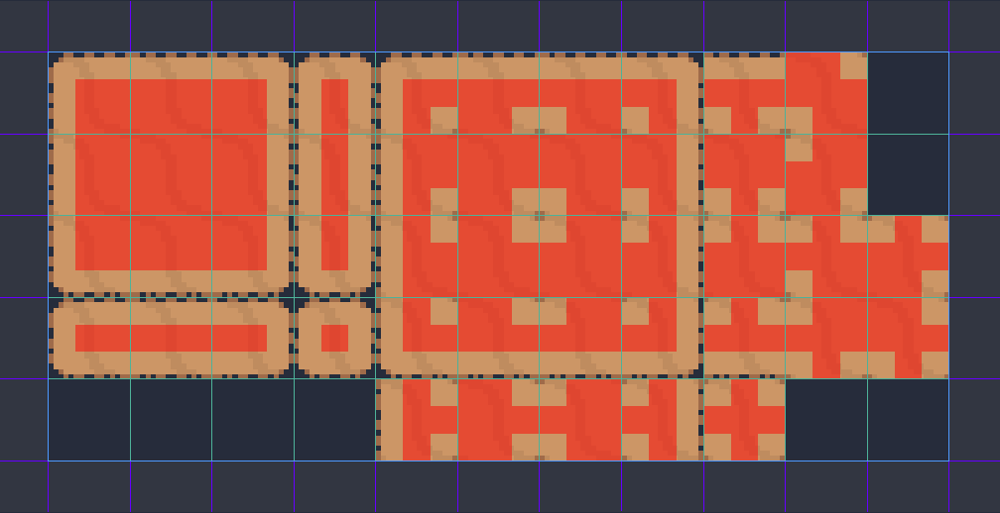

# my-first-action-rpg-game

My first action RPG game in godot.

## Chapter 1: Project Settings

1. 2D, Pixel preset -- set as default texture for imports

2. `Project Settings > Display > Window >`
   * `Size > Width = 320`
   * `Size > Height = 180`
   * `Size > Test Width = 1280`
   * `Size > Test Height = 720`
   * `Stretch > Mode = 2D`
   * `Stretch > Aspect = keep`

3. `res://World.tscn` - Create a new 2D node called `World`.
4. `Player` of type `KinematicBody2D`.
   * Create a `Sprite` with texture `res://Player/player.png`.
   * Since, the `Player.png` file contains a lot of frames we need to adjust the `animation` properties for the player sprite. Set the `hframes` property accordingly. In our case there are 60 horizontal frames.
   * Attach a script to the player node.


## Chapter 2 : Movement Physics

Code for calculating the direction unit vector.

```gdscript
var direction_unit_vector := Vector2(
   Input.get_action_strength("ui_right") - Input.get_action_strength("ui_left"),
   Input.get_action_strength("ui_down") - Input.get_action_strength("ui_up")
).normalized()
```

Frame independent change in velocity:

```gdscript
export(float) var MAX_SPEED := 2.5
export(float) var ACCELERATION_MAGNITUDE := 10.0
export(float) var DEACCELERATION_MAGNITUDE := 15.0 

var velocity = Vector2.ZERO

func _physics_process(dt: float) -> void:
	var direction_unit_vector := Vector2(
		Input.get_action_strength("ui_right") - Input.get_action_strength("ui_left"),
		Input.get_action_strength("ui_down") - Input.get_action_strength("ui_up")
	).normalized()	
	
	if direction_unit_vector != Vector2.ZERO:
		velocity = velocity.move_toward(direction_unit_vector * MAX_SPEED, ACCELERATION_MAGNITUDE * dt)
	else:
		velocity = velocity.move_toward(Vector2.ZERO, DEACCELERATION_MAGNITUDE * dt)
	
	var obj : KinematicCollision2D = move_and_collide(velocity)
	if (obj != null):
		velocity = obj.collider_velocity
```

Refer Chapter 4 of https://salmanisaleh.files.wordpress.com/2019/02/fundamentals-of-physics-textbook.pdf

```
dv = a dt 

=> v = a (t2 - t1) + constant

OR 

=> final velocity = initial velocity + acceleration * delta-time
```

## Chapter 3: Collision Physics

First step is to add a `CollisionShape2D` for the movement to the player node. It should look something like this:


## Chapter 4: Creating World Elements

1. Bush
   * `StaticBody2D`
   * `Sprite`

2. Change type of World node to ysort.


## Chapter 5: Player Animation Part - 1

Use of `AnimationPlayer` node. We will use sprite's hframes as key frames for the animation. 
These are 4 basic movement animations and 4 basic idle animations that is needed:

1. run_right & idle_right
2. run_left & idle_left
3. run_up & idle_up
4. run_down & idle_down

Then we will create a function called `_update_player_animation()` that will be called from `_physics_process()` after calculating the direction vector from input strength to update the animation. 

```gdscript
enum State {
	IDLE_RIGHT
	RUN_RIGHT,
	IDLE_UP,
	RUN_UP,
	IDLE_LEFT,
	RUN_LEFT,
	IDLE_DOWN,
	RUN_DOWN
}


const state_to_animation : Dictionary = {
	State.IDLE_RIGHT : "idle_right",
	State.RUN_RIGHT : "run_right",
	State.IDLE_UP : "idle_up",
	State.RUN_UP : "run_up",
	State.IDLE_LEFT : "idle_left",
	State.RUN_LEFT : "run_left",
	State.IDLE_DOWN : "idle_down",
	State.RUN_DOWN : "run_down"
}


var velocity = Vector2.ZERO

onready var animation_player : AnimationPlayer = $AnimationPlayer
onready var player_state = State.IDLE_RIGHT setget set_player_state, get_player_state

func set_player_state(movement_direction : Vector2):
	if (movement_direction.x > 0):
		player_state = State.RUN_RIGHT
	elif (movement_direction.x < 0):
		player_state = State.RUN_LEFT
	elif (movement_direction.y > 0):
		player_state = State.RUN_DOWN
	elif (movement_direction.y < 0):
		player_state = State.RUN_UP		
	else:
		player_state = State.IDLE_RIGHT


func get_player_state():
	return player_state


func _update_player_animation() -> void:
	animation_player.play(state_to_animation[player_state])
```

Here is the basic movement demo:


## Chapter 6: Animation Trees - 2

Animation in each direction can be elegantly coded with an `AnimationTree` node to replace the code written in previous chapter.
Therefore, create a new child node `AnimationTree` for `Player` and set the `anim_player` property to `AnimationPlayer` node and `tree_root` to a `AnimationNodeStateMachine` and enable the `active` property.

Then add 2 `BlendSpace2D` for Idle and Run.


```gdscript
onready var animation_player : AnimationPlayer = $AnimationPlayer
onready var animation_tree : AnimationTree = $AnimationTree
onready var animation_state = animation_tree.get("parameters/playback")

func _physics_process(dt: float) -> void:
	var direction_unit_vector := Vector2(
		Input.get_action_strength("ui_right") - Input.get_action_strength("ui_left"),
		Input.get_action_strength("ui_down") - Input.get_action_strength("ui_up")
	).normalized()	
		
	if direction_unit_vector != Vector2.ZERO:
		animation_tree.set("parameters/Idle/blend_position", direction_unit_vector)
		animation_tree.set("parameters/Run/blend_position", direction_unit_vector)
		animation_state.travel("Run")
		velocity = velocity.move_toward(direction_unit_vector * MAX_SPEED, ACCELERATION_MAGNITUDE * dt)
	else:
		animation_state.travel("Idle")		
		velocity = velocity.move_toward(Vector2.ZERO, DEACCELERATION_MAGNITUDE * dt)
	
	var obj : KinematicCollision2D = move_and_collide(velocity)
	if (obj != null):
		velocity = obj.collider_velocity
```

## Chapter 7: Autotile

Change the type of `World` node back to node 2D and create a separate child `YSort` node and drag the player and bush nodes as child of `YSort`.

First task is to set the background grass. There are 2 methods to add a texture background.

1. By using the sprite texture region method (prefer this method)
2. By using TextureRect (not preferred)


Add a new `TileMap` node and set autotiles. Use the following bitmap mask.



Finally draw some tiles on the level.


Create another autotile set for cliff. Call it `CliffTileMap`.
Next step is to set some collisions with tile map.


The bitmask for tile set follows same pattern. Then set the collision shapes to the autotiles to enable the collisions.


Here is the demo:


## Chapter 8: Animating Attack

Create 4 basic attack animations and add them to the animation tree in a `BlendShape2D` node.
Also, add animation callbacks to `attack_move_finished()` function to change the player state variable. (refer the code)


```gdscript
enum State {
	MOVE,
	ROLL,
	ATTACK
}

onready var animation_player : AnimationPlayer = $AnimationPlayer
onready var animation_tree : AnimationTree = $AnimationTree
onready var animation_state = animation_tree.get("parameters/playback")
onready var player_state = State.MOVE


func _ready() -> void:
	animation_tree.active = true


func _physics_process(dt: float) -> void:
	match player_state:
		State.MOVE:
			move_state(dt)
				
		State.ROLL:
			pass
		
		State.ATTACK:
			attack_state()


func move_state(dt) -> void:
	var direction_unit_vector := Vector2(
		Input.get_action_strength("ui_right") - Input.get_action_strength("ui_left"),
		Input.get_action_strength("ui_down") - Input.get_action_strength("ui_up")
	).normalized()	
		
	if direction_unit_vector != Vector2.ZERO:
		animation_tree.set("parameters/Idle/blend_position", direction_unit_vector)
		animation_tree.set("parameters/Run/blend_position", direction_unit_vector)
		animation_tree.set("parameters/Attack/blend_position", direction_unit_vector)
		animation_state.travel("Run")
		velocity = velocity.move_toward(direction_unit_vector * MAX_SPEED, ACCELERATION_MAGNITUDE * dt)
	else:
		animation_state.travel("Idle")		
		velocity = velocity.move_toward(Vector2.ZERO, DEACCELERATION_MAGNITUDE * dt)
	
	var obj : KinematicCollision2D = move_and_collide(velocity)
	if (obj != null):
		velocity = obj.collider_velocity

	if Input.is_action_just_pressed("attack"):
		player_state = State.ATTACK


func attack_state() -> void:
	velocity = Vector2.ZERO
	animation_state.travel("Attack")


func attack_move_finished() -> void:
	player_state = State.MOVE

```


## Chapter 9 : Grass Death Effect & Instancing

First, make all the `Bush` node the child of another `YSort` node called `Bushes`.


Create a grass scene from a `Node2D` scene. Drop some grass to the world. And attach a script `Grass.gd` to it.
Now we need to create a grass death effect from a `Node2D` scene. To the grass death effect add animated sprite node with grass effect sprite sheet.


Then add code for instancing the grass effect on runtime in `Grass.gd`.

```gdscript
func _physics_process(delta: float) -> void:
	if Input.is_action_just_pressed("attack"):
		var GrassEffectScene : PackedScene = load("res://Effects/GrassEffect.tscn")
		var grass_effect = GrassEffectScene.instance()
		var world = get_tree().current_scene
		world.add_child(grass_effect)
		grass_effect.global_position = global_position
		queue_free()

```

The above code illustrates the instancing during runtime. The solution is not complete as the hurtboxes and hitboxes are not implemented yet.

